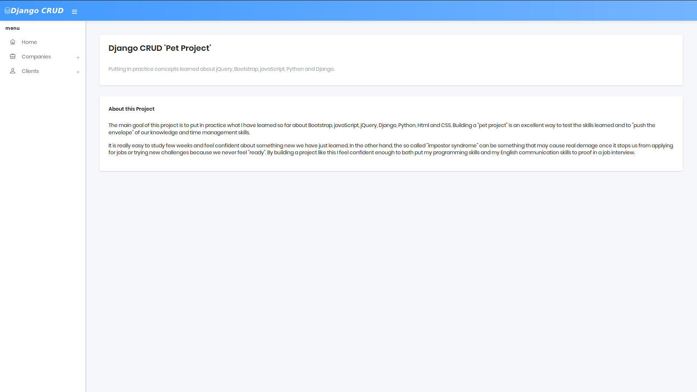
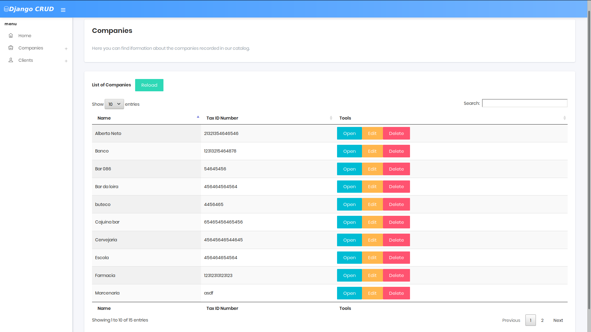
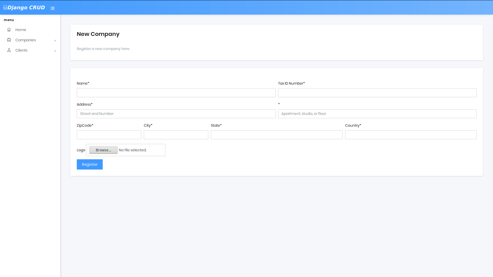
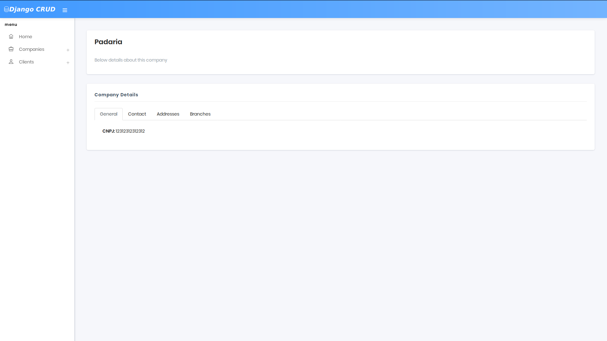

# Django CRUD


## Screenshots

| Column A                        | Column B                        | 
|---------------------------------|---------------------------------|
|      | |                            
|   |  |

## About

Putting in practice concepts learned about jQuery, Bootstrap, javaScript, Python and Django.

## Installation

- Create a virtual environment with python 3.6. In my case I used conda for that.
```shell
conda create -n crudEnv python=3.6
```
- Activate the virtual environment you have just created:
```shell
conda activate crudEnv
```
- Clone the repository:
```shell
git clone https://github.com/albertosdneto/crudProject.git
```
- Go to the crudProject folder and install the requirements:
```shell
cd crudProject

pip install -r requirements.txt
```
- Install and configure PostgreSQL: you may find the links below useful:
  - <https://help.ubuntu.com/community/PostgreSQL>
  - <https://medium.com/agatha-codes/painless-postgresql-django-d4f03364989>
  - <https://medium.com/@lucas_souto/integrando-django-com-postgresql-58b3520ddf6e>

- Setup environment variables that will be used by ```settings.py```:
``` shell
export SECRET_KEY="some_random_key"

export DB_NAME="setup_database"
export DB_USER="setup_user"
export DB_PASS="setup_password"
```

- Migrate database:
```shell
python manage.py makemigrations
python manage.py migrate
```
- Create Superuser:
```shell
python manage.py createsuperuser
```
- Run the project:
```shell
python manage.py runserver
```
- Go to the project url and verify if it is running. Enjoy.
